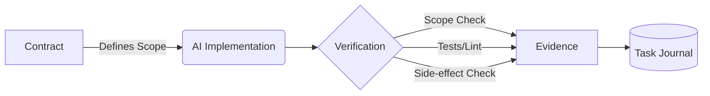

> ## ⛔ REPO NÀY ĐÃ ĐÓNG — 2026-08-06
>
> Không phát triển tiếp. Sản phẩm Atoryn Forge đã chuyển sang repo mới:
> **`/home/thunder/Code/atoryn-forge-web`**
>
> Repo này giữ lại làm **nguồn tham khảo kỹ thuật**, không phải nguồn định hướng sản phẩm.
> Phần còn giá trị: task contract, kiểm phạm vi diff, bounded command, evidence record,
> task journal hash-chain — sẽ được viết lại (không copy nguyên khối) khi dự án mới tới mốc 3.
>
> `docs/PRODUCT.md` trong repo này **đã lỗi thời**. Nguồn sự thật là
> `atoryn-forge-web/docs/PRODUCT.md`.

# Atoryn Forge — deterministic governance for AI-generated code


**Atoryn Forge** is a zero-dependency CLI and TypeScript library that makes AI coding agents auditable and governable. It provides a contract, lifecycle and evidence protocol that answers a simple question: *"Did the AI agent do exactly what it was asked to do, and nothing more?"*

> Forge was previously published as `cw` / CycleWarden. The `cw` command is kept as an alias, existing `.cw/` state directories are still read, and records digested under the old domains still verify. See [Migrating from cw](#migrating-from-cw).

## Why Forge?

**The problem:** AI agents (Cursor, Copilot, SWE-agent) write code without accountability. They can modify files they shouldn't, introduce subtle regressions, or silently break system constraints. Existing tools focus on *writing* the code, not *verifying* its safety and compliance.

**The solution:** Deterministic contracts + an enforced task lifecycle + independent verification. Forge contracts what an AI is allowed to do, records every lifecycle transition in a hash-chained journal, and independently verifies the outcome.

**Unique value:**
- **Zero-trust verification:** Verification commands run in a clean, observable environment that detects side-effects and unauthorized scope changes.
- **Durable task lifecycle:** Every task carries a hash-chained journal of its state transitions — who caused each one, when, under which run — instead of state being guessed from a directory listing.
- **Evidence integrity:** Contracts, evidence and journal events are digest-linked to specific Git SHAs and to each other.
- **Agent-agnostic:** Works with any tool — Cursor, Aider, Claude Code, or an autonomous backend script.
- **Zero dependencies:** Built purely on Node.js and Git internals for maximum stability and minimal supply chain risk.

## Quick Start

```bash
# Initialize Forge in your project
npx atoryn-forge init --auto

# Create a contract from your task spec
npx atoryn-forge prepare --spec task.json

# Let your AI agent implement the task...

# Verify the implementation against the contract
npx atoryn-forge verify --contract .forge/tasks/<id>/contract.json --trusted-repository

# Inspect lifecycle state and re-check the journal chain
npx atoryn-forge status
npx atoryn-forge audit verify
```

## How It Works



1. **Contract**: A rigid specification of allowed paths, forbidden paths, and verification commands, pinned to a clean Git base.
2. **AI Implementation**: Any agent (or human) modifies the codebase.
3. **Verification**: Forge checks the Git tree diff against the contract, runs bounded verification commands, and ensures no unauthorized workspace mutations occurred.
4. **Evidence**: A digest-linked JSON record asserting whether the change is `accepted`, `rejected`, or `inconclusive`.
5. **Journal**: Every transition is appended to the task's hash-chained journal, so the task's state is a recorded fact rather than an inference.

## Task lifecycle

Forge tracks each task through an enforced state machine. Illegal transitions fail closed rather than being recorded.

```text
draft ──► prepared ──► verifying ──► accepted   (terminal)
             │             │
             │             ├──► rejected ──┐
             │             │               │
             └─────────────┴──► implementing
                                     │
                                     └──► verifying
```

- Forge never observes an agent writing code, so `implementing` is where a task **returns** after a non-accepting verdict — not a state Forge watches it enter.
- An **inconclusive** verdict decides nothing, so the task returns to `implementing`.
- A **rejected** verdict judges one attempt, not the task: it can be fixed and verified again.
- **`accepted` is the only terminal state.** Re-verifying an accepted task fails closed.

Each journal event records `eventId`, `sequenceNumber`, `recordedAt`, `eventType`, `actor`, `source`, `correlationId` (the agent run), `fromState`/`toState`, the digest of the record it attests to, and the chain digests. Appending the same `eventId` twice is a no-op, so a retried command cannot double-append.

Verify a journal at any time:

```bash
$ forge audit verify
Success: 1 task journal(s) verified under /repo/.forge
  my-task: 3 events, root 9f2c…
```

`audit verify` fails closed (exit 1) when there is no journal to verify — reporting success over an empty log would be a false assurance.

## CLI Reference

| Command | Description |
|---|---|
| `forge init` | Initialize Forge in the current project |
| `forge doctor` | Check environment health and dependencies |
| `forge prepare` | Create a deterministic task contract |
| `forge verify` | Verify an AI implementation against contract |
| `forge show` | Inspect a contract or evidence record |
| `forge status` | Show a dashboard of tasks and their lifecycle state |
| `forge list` | List all task contracts, states and verifications |
| `forge audit` | Inspect and verify the task lifecycle journals |
| `forge diff` | Evaluate Git tree changes against baseSha |
| `forge watch` | Watch for task changes |
| `forge report` | Generate a compliance report of all tasks |
| `forge clean` | Clean temporary files and rejected runs |
| `forge export` | Export contracts and evidence to a bundle |
| `forge map` | Generate a context map of repository symbols |
| `forge provenance` | Manage AI provenance records |
| `forge help` / `forge version` | Help and version |

Global options: `--json`, `--project-root <dir>`, `--root <state-dir>`.

`verify` exit codes: `0` accepted, `2` rejected, `3` inconclusive.

## Architecture

Forge is designed with a strict layered architecture:
- **Core Engine**: The domain logic. Contracts, verification, bounded commands, task journal, state machine, risk scoring, and digest integrity.
- **Git Layer**: Direct interface with Git objects and trees (without parsing `git log` output).
- **Store Layer**: Manages the state directory, atomic JSON writes, and persistent records. `src/store/runtime-paths.ts` is the single source of truth for where state lives.
- **CLI Layer**: The commands that expose the core capabilities to the terminal.

## Comparison Table

| Feature | Forge | Aider / Cursor | SWE-agent |
|---|---|---|---|
| **Goal** | Governance & Verification | Code Generation | Autonomous Issue Resolution |
| **Scope Enforcement** | Digest-verified contracts | Prompt-based (soft) | Prompt-based (soft) |
| **Task lifecycle** | Enforced state machine + hash-chained journal | None | Run logs |
| **Side-effect Detection** | Yes (Git tree checks) | No | No |
| **Evidence Records** | Digest-linked JSON payloads | None | Run logs |
| **Integrations** | Any agent or human | Built-in models only | Built-in pipeline |

## API Usage

Forge is fully typed and can be integrated directly into your CI/CD pipelines or custom agent backends.

```typescript
import { prepareTaskContract, verifyChange, readTaskJournal } from 'atoryn-forge';

// Prepare a contract
const contract = await prepareTaskContract({
  repositoryRoot: process.cwd(),
  draft: myTaskSpec,
  preparedBy: 'ci-pipeline',
});

// Verify the result
const evidence = await verifyChange({
  repositoryRoot: process.cwd(),
  contract,
  implementer: { provider: 'cursor', runId: 'session-123' },
});

console.log(`Verdict: ${evidence.verdict}`);

// Read the durable lifecycle
const journal = await readTaskJournal('.forge', contract.taskId);
console.log(`State: ${journal?.state}, events: ${journal?.events.length}`);
```

## Migrating from cw

Nothing is required to keep working:

| Concern | Behaviour |
|---|---|
| `cw` command | Still installed as an alias of `forge`. |
| `.cw/` state directory | Still used when it already exists; new projects get `.forge/`. Override with `--root`. |
| Contracts and evidence digested under `cyclewarden.*.v1` | Still verify. Forge issues new digests under `atoryn.forge.*.v2` and accepts the old domains on the read path only. |
| Tasks with no journal | Reported as state `unknown`; the journal is seeded from the existing contract on the next `verify`. |

Two intentional behaviour changes:

- **Re-verifying an accepted task now fails closed.** Previously it silently produced a second evidence record.
- **`audit` operates on task journals** in the project state directory, not a separate global log. The previous `cw audit` read a path nothing ever wrote to, so `cw audit verify` reported success over an empty log.

## Contributing

1. Ensure `npm run typecheck` and `npm test` pass before submitting a PR.
2. Maintain the zero-dependency rule for the runtime (devDependencies are fine).
3. Follow the established layered architecture (no Core depending on CLI).

## License

MIT
