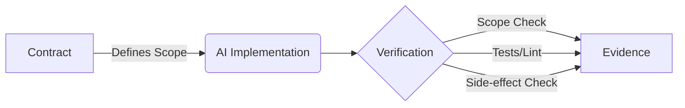

# cw — Deterministic governance for AI-generated code


**cw (Cyclewarden)** is a zero-dependency CLI and TypeScript library that makes AI coding agents auditable and governable. It provides a cryptographic contract-and-evidence protocol that answers a simple question: *"Did the AI agent do exactly what it was asked to do, and nothing more?"*

## Why CW?

**The problem:** AI agents (Cursor, Copilot, SWE-agent) write code without accountability. They can modify files they shouldn't, introduce subtle regressions, or silently break system constraints. Existing tools focus on *writing* the code, not *verifying* its safety and compliance.

**The solution:** Deterministic contracts + cryptographic verification. CW enforces boundaries by explicitly contracting what an AI is allowed to do, and then independently verifying the outcome.

**Unique value:**
- **Zero-trust verification:** Verification commands run in a clean, observable environment that detects side-effects and unauthorized scope changes.
- **Cryptographic integrity:** Every contract and verification produces a cryptographically signed evidence record linked to specific Git SHAs.
- **Agent-agnostic:** Works with any tool—whether it's Cursor, Aider, Claude Code, or an autonomous backend script.
- **Zero dependencies:** Built purely on Node.js and Git internals for maximum stability and minimal supply chain risk.

## Quick Start

```bash
# Initialize CW in your project
npx cw init --auto

# Let your AI agent implement the task...

# Verify the implementation against the contract
npx cw verify --contract .cw/tasks/<id>/contract.json
```

## How It Works



1. **Contract**: A rigid specification of allowed paths, forbidden paths, and verification commands.
2. **AI Implementation**: Any agent (or human) modifies the codebase.
3. **Verification**: CW checks the Git tree diff against the contract, runs verification commands, and ensures no unauthorized workspace mutations occurred.
4. **Evidence**: A cryptographically signed JSON record is produced, asserting whether the change is `accepted`, `rejected`, or `inconclusive`.

## CLI Reference

| Command | Description |
|---|---|
| `cw init` | Initialize CW in the current project |
| `cw prepare` | Create a deterministic task contract |
| `cw verify` | Verify an AI implementation against contract |
| `cw show` | Inspect a contract or evidence record |
| `cw status` | Show a dashboard of tasks and their state |
| `cw list` | List all task contracts and verifications |
| `cw diff` | Evaluate Git tree changes against baseSha |
| `cw watch` | Watch for task changes |
| `cw report` | Generate a compliance report of all tasks |
| `cw clean` | Clean temporary files and rejected runs |
| `cw export` | Export contracts and evidence to a bundle |
| `cw map` | Generate a context map of repository symbols |
| `cw help` | Show help message |
| `cw version` | Show version |

## Architecture

CW is designed with a strict layered architecture:
- **Core Engine**: The domain logic (14 modules). Handles contracts, verification, bounding, risk scoring, state machines, and cryptographic integrity.
- **Git Layer**: Direct interface with Git objects and trees (without parsing `git log` output).
- **Store Layer**: Manages the `.cw` directory state, atomic JSON writes, and persistent records.
- **CLI Layer**: The 14 commands that expose the core capabilities to the terminal.

## Comparison Table

| Feature | CW | Aider / Cursor | SWE-agent |
|---|---|---|---|
| **Goal** | Governance & Verification | Code Generation | Autonomous Issue Resolution |
| **Scope Enforcement** | Cryptographic verification | Prompt-based (soft) | Prompt-based (soft) |
| **Side-effect Detection** | Yes (Git tree checks) | No | No |
| **Evidence Records** | Cryptographic JSON payloads | None | Run logs |
| **Integrations** | Any agent or human | Built-in models only | Built-in pipeline |

## API Usage

CW is fully typed and can be integrated directly into your CI/CD pipelines or custom agent backends.

```typescript
import { prepareTaskContract, verifyChange } from 'cw';

// Prepare a contract
const contract = await prepareTaskContract({
  repositoryRoot: process.cwd(),
  draft: myTaskSpec,
  preparedBy: 'ci-pipeline',
});

// Verify the result
const evidence = await verifyChange({
  repositoryRoot: process.cwd(),
  contract,
  implementer: { provider: 'cursor', runId: 'session-123' },
});

console.log(`Verdict: ${evidence.verdict}`);
```

## Contributing

We welcome contributions! Please follow these guidelines:
1. Ensure `npm run typecheck` and `npm test` pass before submitting a PR.
2. Maintain the zero-dependency rule for the runtime (devDependencies are fine).
3. Follow the established layered architecture (no Core depending on CLI).

## License

MIT
